# 2. Database Design

[Provide the files description, database table relationship & table descriptions like example below]

*(Insert the massive DBML Entity-Relationship image you exported from dbdiagram.io here. The simplified relationship view is included below for structural reference).*

```mermaid
erDiagram
    USER { string id PK string role }
    USER_ADDRESS { string id PK string userId FK }
    OAUTH_ACCOUNT { string id PK string userId FK }
    SESSION { string id PK string userId FK }
    QUIZ_RESULT { string id PK string userId FK }
    LOYALTY_TRANSACTION { string id PK string userId FK }
    NOTIFICATION { string id PK string userId FK }
    AI_REQUEST_LOG { string id PK string userId FK }
    AUDIT_LOG { int id PK string userId FK }

    PRODUCT { string id PK int brandId FK int categoryId FK }
    PRODUCT_VARIANT { string id PK string productId FK }
    BRAND { int id PK string name }
    CATEGORY { int id PK string name }
    SCENT_FAMILY { int id PK string name }
    SCENT_NOTE { int id PK string name }
    PRODUCT_IMAGE { int id PK string productId FK }
    PRODUCT_SCENT_NOTE { string productId PK int noteId PK }
    USER_SCENT_PREFERENCE { int id PK string userId FK }

    STORE { string id PK string name }
    STORE_STOCK { string storeId PK string variantId PK }
    USER_STORE { string userId PK string storeId PK }
    INVENTORY_LOG { int id PK string storeId FK }
    INVENTORY_REQUEST { int id PK string storeId FK }

    CART { string id PK string userId FK }
    CART_ITEM { int id PK string cartId FK }

    ORDER { string id PK string userId FK string storeId FK }
    ORDER_ITEM { int id PK string orderId FK string variantId FK }
    ORDER_STATUS_HISTORY { int id PK string orderId FK }
    PAYMENT { string id PK string orderId FK }
    SHIPMENT { string id PK string orderId FK }

    PROMOTION_CODE { string id PK string code }
    USER_PROMOTION { string id PK string promotionId FK }
    APPLIED_PROMOTION { string id PK string orderId FK }

    REVIEW { string id PK string productId FK }
    REVIEW_IMAGE { string id PK string reviewId FK }
    REVIEW_REACTION { string id PK string reviewId FK }
    REVIEW_REPORT { string id PK string reviewId FK }
    REVIEW_SUMMARY { string id PK string productId FK }

    CONVERSATION { string id PK string type }
    CONVERSATION_PARTICIPANT { string id PK string conversationId FK }
    MESSAGE { string id PK string conversationId FK }

    FAVORITE { string userId PK string productId PK }
    BANNER { string id PK string title }
    JOURNAL { string id PK string title }
    JOURNAL_SECTION { string id PK string journalId FK }

    RETURN_REQUEST { string id PK string orderId FK }
    RETURN_ITEM { string id PK string returnRequestId FK }
    RETURN_SHIPMENT { string id PK string returnRequestId FK }
    RETURN_AUDIT { string id PK string returnId FK }
    REFUND { string id PK string returnRequestId FK }

    %% Identity & Tracking
    USER ||--o{ USER_ADDRESS : "owns"
    USER ||--|{ OAUTH_ACCOUNT : "auths"
    USER ||--|{ SESSION : "logs in"
    USER ||--o{ QUIZ_RESULT : "takes quiz"
    USER ||--o{ LOYALTY_TRANSACTION : "points"
    USER ||--o{ NOTIFICATION : "receives"
    USER ||--o{ AI_REQUEST_LOG : "asks AI"
    USER ||--o{ AUDIT_LOG : "audits"

    %% Catalog
    BRAND ||--|{ PRODUCT : "manufactures"
    CATEGORY ||--|{ PRODUCT : "groups"
    SCENT_FAMILY ||--|{ PRODUCT : "classifies"
    PRODUCT ||--|{ PRODUCT_VARIANT : "has variants"
    PRODUCT ||--o{ PRODUCT_IMAGE : "gallery"
    SCENT_NOTE ||--o{ PRODUCT_SCENT_NOTE : "notes"
    PRODUCT ||--o{ PRODUCT_SCENT_NOTE : "notes"
    USER ||--o{ USER_SCENT_PREFERENCE : "prefers"
    SCENT_FAMILY ||--o{ USER_SCENT_PREFERENCE : "prefers"
    SCENT_NOTE ||--o{ USER_SCENT_PREFERENCE : "prefers"

    %% Points of Sale & Inventory
    STORE ||--|{ STORE_STOCK : "stocks"
    PRODUCT_VARIANT ||--|{ STORE_STOCK : "allocated"
    USER ||--o{ USER_STORE : "staffed by"
    STORE ||--o{ USER_STORE : "staffing"
    STORE ||--o{ INVENTORY_LOG : "logs"
    PRODUCT_VARIANT ||--o{ INVENTORY_LOG : "variant logs"
    USER ||--o{ INVENTORY_LOG : "executes"
    STORE ||--o{ INVENTORY_REQUEST : "requests"
    PRODUCT_VARIANT ||--o{ INVENTORY_REQUEST : "variant req"

    %% Shopping 
    USER ||--|{ CART : "manages"
    CART ||--|{ CART_ITEM : "contains"
    PRODUCT_VARIANT ||--o{ CART_ITEM : "added to"
    USER ||--o{ FAVORITE : "favorites"
    PRODUCT ||--o{ FAVORITE : "favorited"

    %% Orders
    USER ||--o{ ORDER : "places/processes"
    STORE ||--o{ ORDER : "POS origin"
    ORDER ||--|{ ORDER_ITEM : "contains"
    PRODUCT_VARIANT ||--o{ ORDER_ITEM : "matched"
    ORDER ||--|{ ORDER_STATUS_HISTORY : "tracks"
    ORDER ||--o| PAYMENT : "paid via"
    ORDER ||--o| SHIPMENT : "shipped via"

    %% Marketing
    PROMOTION_CODE ||--o{ USER_PROMOTION : "claimed by"
    USER ||--o{ USER_PROMOTION : "claims"
    ORDER ||--o{ APPLIED_PROMOTION : "discounted by"
    PROMOTION_CODE ||--o{ APPLIED_PROMOTION : "applies"

    %% Reviews
    PRODUCT ||--o{ REVIEW : "receives"
    USER ||--o{ REVIEW : "writes"
    ORDER_ITEM ||--o| REVIEW : "verified by"
    REVIEW ||--o{ REVIEW_IMAGE : "media"
    REVIEW ||--o{ REVIEW_REACTION : "reactions"
    USER ||--o{ REVIEW_REACTION : "reacts"
    REVIEW ||--o{ REVIEW_REPORT : "reports"
    PRODUCT ||--o| REVIEW_SUMMARY : "summary"

    %% Communications
    CONVERSATION ||--o{ CONVERSATION_PARTICIPANT : "participants"
    USER ||--o{ CONVERSATION_PARTICIPANT : "actor"
    CONVERSATION ||--o{ MESSAGE : "messages"
    USER ||--o{ MESSAGE : "sender"

    %% Content 
    JOURNAL ||--o{ JOURNAL_SECTION : "sections"
    PRODUCT ||--o{ JOURNAL_SECTION : "recommends"

    %% Returns
    ORDER ||--o{ RETURN_REQUEST : "generates"
    USER ||--o{ RETURN_REQUEST : "submits/approves"
    RETURN_REQUEST ||--|{ RETURN_ITEM : "items"
    PRODUCT_VARIANT ||--o{ RETURN_ITEM : "variant"
    RETURN_REQUEST ||--o| RETURN_SHIPMENT : "reships"
    RETURN_REQUEST ||--o{ RETURN_AUDIT : "audits"
    RETURN_REQUEST ||--o| REFUND : "refunds"
```

## Table Descriptions

| No | Table | Description |
| :--- | :--- | :--- |
| 01 | User | Stores base credentials, roles (Admin/Staff/Customer), and profile states.  - Primary keys: id - Foreign keys: None |
| 02 | UserAddress | Geographical delivery addresses (provinces, districts) mapped to GHN.  - Primary keys: id - Foreign keys: userId |
| 03 | OAuthAccount | Social authentication tokens tied to Google/Facebook integrations.  - Primary keys: id - Foreign keys: userId |
| 04 | Session | Device sessions tracking JWT Refresh Tokens, IP, and Expiry.  - Primary keys: id - Foreign keys: userId |
| 05 | ScentFamily | Macro scent categorizations (e.g., Floral, Woody) linking to products.  - Primary keys: id - Foreign keys: None |
| 06 | ScentNote | Micro fragrance ingredients (Top, Middle, Base) driving AI analysis.  - Primary keys: id - Foreign keys: None |
| 07 | UserScentPreference | Customer’s explicitly defined scent tastes utilized by the AI logic.  - Primary keys: id - Foreign keys: userId, noteId, scentFamilyId |
| 08 | QuizResult | Persistent records of the AI Perfume Quiz inputs and final recommendation.  - Primary keys: id - Foreign keys: userId |
| 09 | AiRequestLog | Auditing ledger recording HTTP raw JSON requests and LLM prompt responses.  - Primary keys: id - Foreign keys: userId |
| 10 | Brand | Manufacturers or brand houses (e.g., Chanel, Dior).  - Primary keys: id - Foreign keys: None |
| 11 | Category | Types of applications (EDP, EDT, Parfum).  - Primary keys: id - Foreign keys: None |
| 12 | Product | Abstract definitions of a perfume (name, gender, description, properties).  - Primary keys: id - Foreign keys: brandId, categoryId, scentFamilyId |
| 13 | ProductVariant | Distinct SKUs representing sizes (e.g., 50ml, 100ml) holding prices.  - Primary keys: id - Foreign keys: productId |
| 14 | ProductImage | URL mappings resolving to Cloudinary high-fidelity images sorting visual order.  - Primary keys: id - Foreign keys: productId |
| 15 | ProductScentNote | Conjunction table linking specific Notes to a specific Product.  - Primary keys: productId, noteId - Foreign keys: productId, noteId |
| 16 | Store | Physical boutique operational locations.  - Primary keys: id - Foreign keys: None |
| 17 | UserStore | Staff assignment matrix granting staff privileges to specific stores.  - Primary keys: userId, storeId - Foreign keys: userId, storeId |
| 18 | StoreStock | Conjunction reflecting real-time physical availability of variants inside a store.  - Primary keys: storeId, variantId - Foreign keys: storeId, variantId |
| 19 | InventoryLog | Immutable ledger of manual inputs, sales, and corrections to quantities.  - Primary keys: id - Foreign keys: variantId, staffId, storeId |
| 20 | InventoryRequest | Multi-step approval workflows for importing or transferring deep stock.  - Primary keys: id - Foreign keys: storeId, variantId, staffId, reviewedBy |
| 21 | Cart | Volatile shopping basket state tied 1-to-1 with a User.  - Primary keys: id - Foreign keys: userId |
| 22 | CartItem | Pointers retaining intended variant variants and aggregated quantities.  - Primary keys: id - Foreign keys: cartId, variantId |
| 23 | Order | Finalized checkout container recording addresses, channel (POS/Online).  - Primary keys: id - Foreign keys: userId, staffId, storeId |
| 24 | OrderItem | Snapshot line items locking in historical prices preventing drift.  - Primary keys: id - Foreign keys: orderId, variantId |
| 25 | OrderStatusHistory | Lifecycle transition log tracking timestamped status changes.  - Primary keys: id - Foreign keys: orderId |
| 26 | Payment | Tracking table interfacing with VNPay/Momo tracking successful callbacks.  - Primary keys: id - Foreign keys: orderId |
| 27 | Shipment | Logistics table interfacing with GHN tracking delivery waybill numbers.  - Primary keys: id - Foreign keys: orderId |
| 28 | PromotionCode | Encoded discount parameters, min order boundaries, and expiration gates.  - Primary keys: id - Foreign keys: None |
| 29 | UserPromotion | Represents a voucher "claimed" by a distinct user dictating usage state.  - Primary keys: id - Foreign keys: userId, promotionId |
| 30 | AppliedPromotion | Conjunction linking a used promotion algorithmically to an exact order.  - Primary keys: id - Foreign keys: orderId, promotionCodeId, userPromotionId |
| 31 | LoyaltyTransaction | Ledger dictating earned (+) and redeemed (-) rewards Points.  - Primary keys: id - Foreign keys: userId |
| 32 | Favorite | User’s curated wishlist mechanism linked to products/variants.  - Primary keys: userId, productId - Foreign keys: userId, productId, variantId |
| 33 | Banner | Admin marketing visual payloads positioned globally on the homepage.  - Primary keys: id - Foreign keys: None |
| 34 | Journal | Root container for engaging editorial SEO blog formats.  - Primary keys: id - Foreign keys: None |
| 35 | JournalSection | Rich-text blocks structuring the Journal logically tying content to Products.  - Primary keys: id - Foreign keys: journalId, productId |
| 36 | Review | 5-star customer feedback generated strictly after item delivery.  - Primary keys: id - Foreign keys: userId, productId, orderItemId |
| 37 | ReviewImage | User-uploaded visual evidence augmenting a Review rating.  - Primary keys: id - Foreign keys: reviewId |
| 38 | ReviewReaction | Bi-directional markers registering Community Helpful/Not Helpful clicks.  - Primary keys: id - Foreign keys: reviewId, userId |
| 39 | ReviewReport | Flagging mechanisms isolating spam/inappropriate content for Admins.  - Primary keys: id - Foreign keys: reviewId, userId |
| 40 | ReviewSummary | Autonomous AI-crunched synopsis identifying collective pros/cons.  - Primary keys: id - Foreign keys: productId |
| 41 | Conversation | Central multiplexer wrapping real-time streams (Bot Chat, Admin Chat).  - Primary keys: id - Foreign keys: None |
| 42 | ConversationParticipant | Multi-party assignments specifying Staff/User/AI boundaries.  - Primary keys: id - Foreign keys: conversationId, userId |
| 43 | Message | Segmented JSON payloads dictating message delivery (Text, Product Card).  - Primary keys: id - Foreign keys: conversationId, senderId |
| 44 | Notification | System ping triggers spanning cross-channels (In-App, SMS).  - Primary keys: id - Foreign keys: userId |
| 45 | AuditLog | High-level Admin change history protecting database integrity.  - Primary keys: id - Foreign keys: userId |
| 46 | ReturnRequest | Master tracking document isolating orders requesting post-delivery cancellation.  - Primary keys: id - Foreign keys: orderId, userId, createdBy |
| 47 | ReturnItem | Specifically isolated line-items marking physical damage or leak conditions.  - Primary keys: id - Foreign keys: returnRequestId, variantId |
| 48 | ReturnShipment | Reverse logistics tracking the courier recovering items to the backend.  - Primary keys: id - Foreign keys: returnRequestId |
| 49 | ReturnAudit | Procedural stepping logic capturing when Staff approves/receives returns.  - Primary keys: id - Foreign keys: returnId |
| 50 | Refund | Financial gateway instructions generating capital reversal directly to banks.  - Primary keys: id - Foreign keys: returnRequestId |
