# 3. Detailed Design

This section illustrates the detailed technical diagrams mapping the MVC architectural workflow of the system, capturing every standalone module from Auth to Returns.

---

## 3.1 Authenticate User (Login)
Handles secure verification of user credentials and issues stateless JWT Sessions.

### 3.1.1 Class Diagram
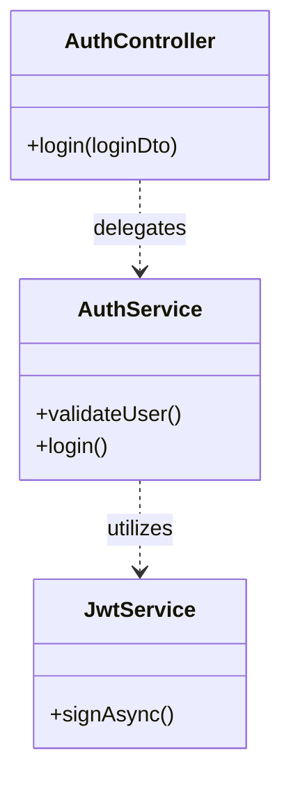
```mermaid
classDiagram
    class AuthController {
        +login(loginDto)
    }
    class AuthService {
        +validateUser()
        +login()
    }
    class JwtService {
        +signAsync()
    }
    AuthController ..> AuthService : delegates
    AuthService ..> JwtService : utilizes
```

### 3.1.2 Class Specifications
- **AuthController:** Parses HTTP requests for login routes.
- **AuthService:** Hashes incoming passwords and compares them with DB records.
- **JwtService:** Externally signs and verifies JSON Web Tokens.

### 3.1.3 Sequence Diagram
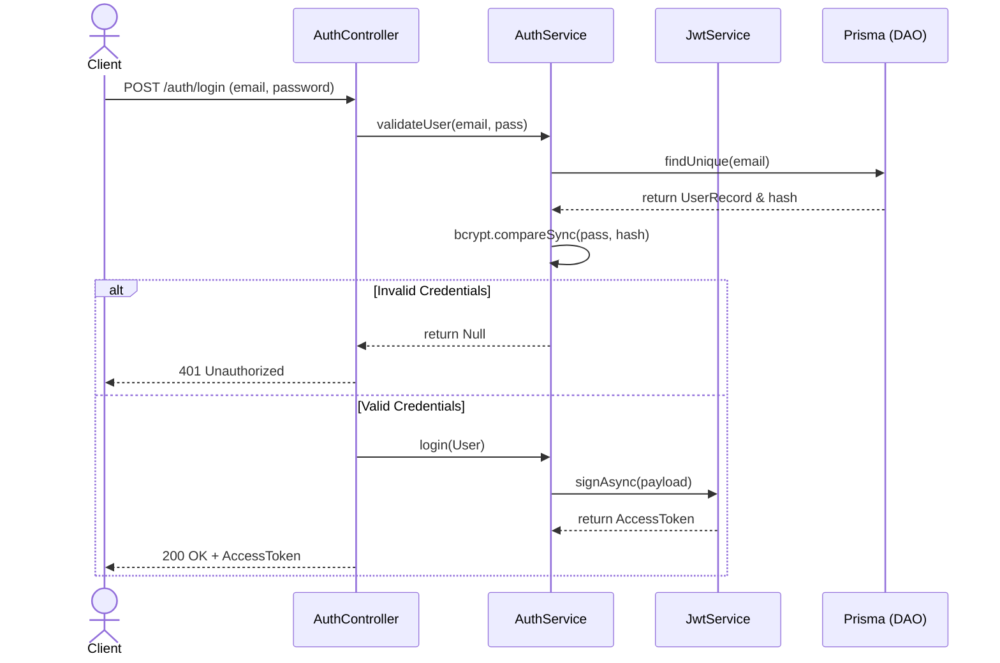
```mermaid
sequenceDiagram
    actor App as Client
    participant AuthCtrl as AuthController
    participant AuthSvc as AuthService
    participant JwtSvc as JwtService
    participant DB as Prisma (DAO)

    App->>AuthCtrl: POST /auth/login (email, password)
    AuthCtrl->>AuthSvc: validateUser(email, pass)
    AuthSvc->>DB: findUnique(email)
    DB-->>AuthSvc: return UserRecord & hash
    
    AuthSvc->>AuthSvc: bcrypt.compareSync(pass, hash)
    alt Invalid Credentials
        AuthSvc-->>AuthCtrl: return Null
        AuthCtrl-->>App: 401 Unauthorized
    else Valid Credentials
        AuthCtrl->>AuthSvc: login(User)
        AuthSvc->>JwtSvc: signAsync(payload)
        JwtSvc-->>AuthSvc: return AccessToken
        AuthCtrl-->>App: 200 OK + AccessToken
    end
```

---

## 3.2 Browse & Filter Product Catalog
Allows Guests and Customers to query the perfume inventory combining search conditions.

### 3.2.1 Class Diagram
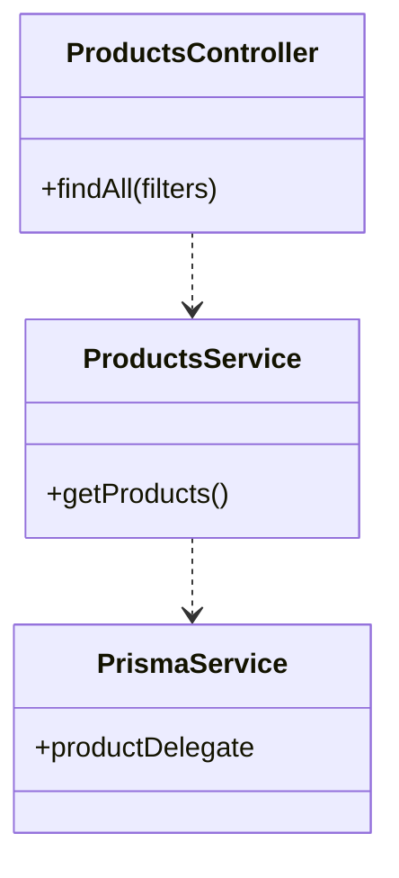
```mermaid
classDiagram
    class ProductsController {
        +findAll(filters)
    }
    class ProductsService {
        +getProducts()
    }
    class PrismaService {
        +productDelegate
    }
    ProductsController ..> ProductsService
    ProductsService ..> PrismaService
```

### 3.2.2 Class Specifications
- **ProductsController:** Public endpoint receiving query parameters.
- **ProductsService:** Maps search strings, price filters to Prisma parameters.
- **PrismaService:** Global DAO querying the database entities.

### 3.2.3 Sequence Diagram
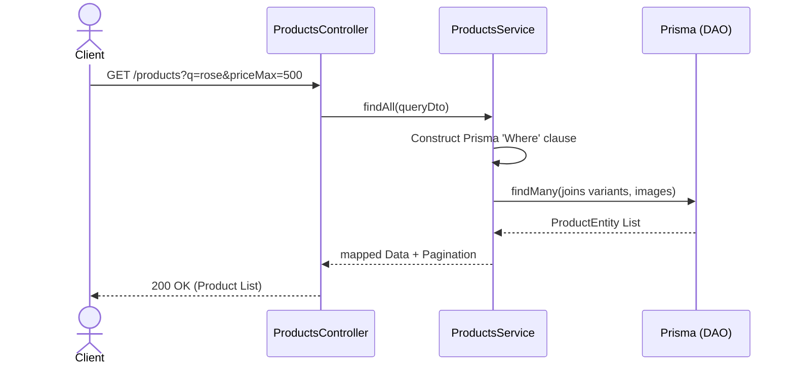
```mermaid
sequenceDiagram
    actor App as Client
    participant Ctrl as ProductsController
    participant Svc as ProductsService
    participant DB as Prisma (DAO)

    App->>Ctrl: GET /products?q=rose&priceMax=500
    Ctrl->>Svc: findAll(queryDto)
    Svc->>Svc: Construct Prisma 'Where' clause
    Svc->>DB: findMany(joins variants, images)
    DB-->>Svc: ProductEntity List
    Svc-->>Ctrl: mapped Data + Pagination
    Ctrl-->>App: 200 OK (Product List)
```

---

## 3.3 Interact with AI Consultant
Real-time LLM-powered natural language chatbot querying perfume recommendations.

### 3.3.1 Class Diagram
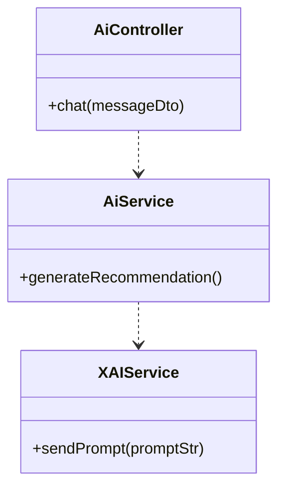
```mermaid
classDiagram
    class AiController {
        +chat(messageDto)
    }
    class AiService {
        +generateRecommendation()
    }
    class XAIService {
        +sendPrompt(promptStr)
    }
    AiController ..> AiService
    AiService ..> XAIService
```

### 3.3.2 Class Specifications
- **AiController:** Entry portal for user text interactions.
- **AiService:** Constructs dynamic System Prompts using user preference DB context.
- **XAIService:** Direct wrapper executing HTTP calls to the external xAI LLM.

### 3.3.3 Sequence Diagram
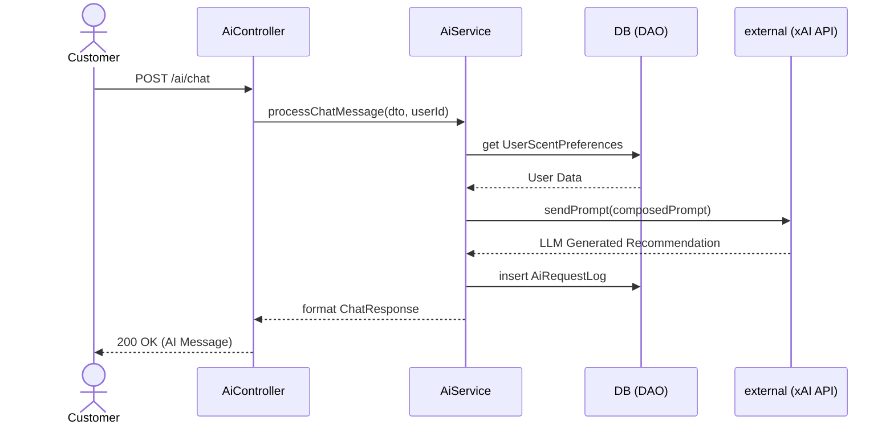
```mermaid
sequenceDiagram
    actor Customer
    participant Ctrl as AiController
    participant Svc as AiService
    participant DB as DB (DAO)
    participant xAI as external (xAI API)

    Customer->>Ctrl: POST /ai/chat
    Ctrl->>Svc: processChatMessage(dto, userId)
    Svc->>DB: get UserScentPreferences
    DB-->>Svc: User Data
    Svc->>xAI: sendPrompt(composedPrompt)
    xAI-->>Svc: LLM Generated Recommendation
    Svc->>DB: insert AiRequestLog
    Svc-->>Ctrl: format ChatResponse
    Ctrl-->>Customer: 200 OK (AI Message)
```

---

## 3.4 Manage Shopping Cart
Customer securely adds selected variants and quantities.

### 3.4.1 Class Diagram
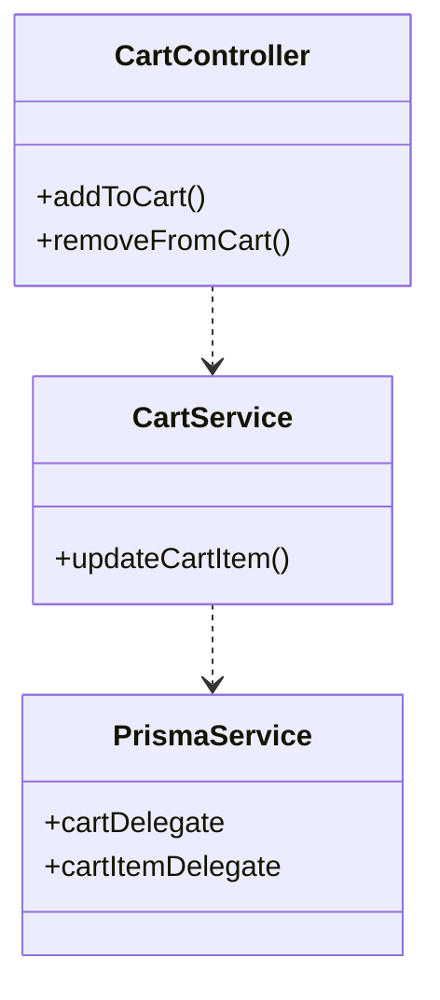
```mermaid
classDiagram
    class CartController {
        +addToCart()
        +removeFromCart()
    }
    class CartService {
        +updateCartItem()
    }
    class PrismaService {
        +cartDelegate
        +cartItemDelegate
    }
    CartController ..> CartService
    CartService ..> PrismaService
```

### 3.4.2 Class Specifications
- **CartController:** Secure endpoints resolving the active JWT state.
- **CartService:** Validates variant limits and overrides duplicate rows.

### 3.4.3 Sequence Diagram
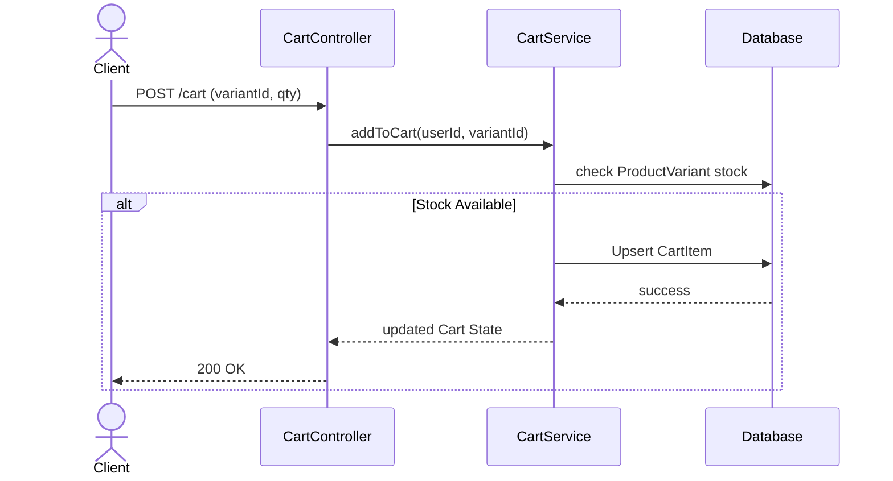
```mermaid
sequenceDiagram
    actor App as Client
    participant Ctrl as CartController
    participant Svc as CartService
    participant DB as Database

    App->>Ctrl: POST /cart (variantId, qty)
    Ctrl->>Svc: addToCart(userId, variantId)
    Svc->>DB: check ProductVariant stock
    alt Stock Available
        Svc->>DB: Upsert CartItem
        DB-->>Svc: success
        Svc-->>Ctrl: updated Cart State
        Ctrl-->>App: 200 OK
    end
```

---

## 3.5 Place Online Order & Checkout
Converts an active cart into an immutable Order, reserving stock.

### 3.5.1 Class Diagram
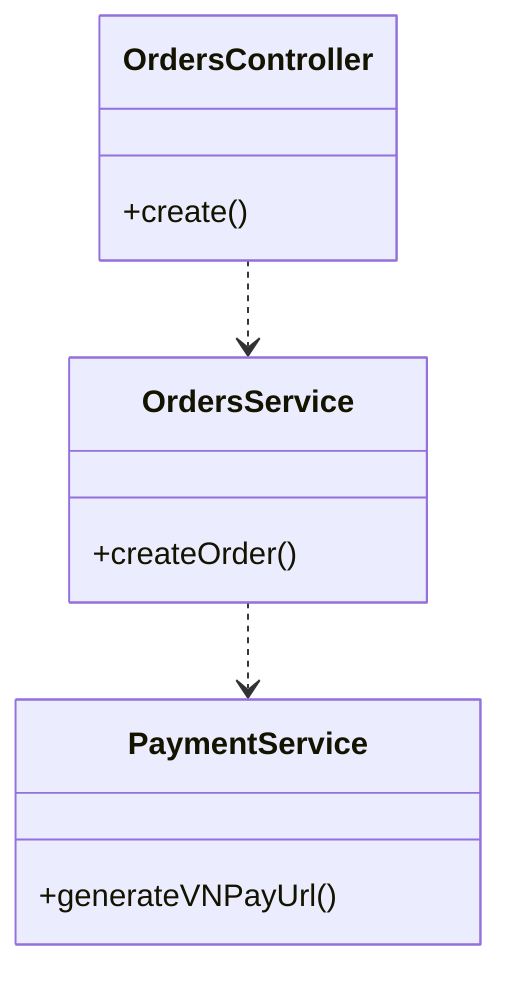
```mermaid
classDiagram
    class OrdersController { +create() }
    class OrdersService { +createOrder() }
    class PaymentService { +generateVNPayUrl() }
    OrdersController ..> OrdersService
    OrdersService ..> PaymentService
```

### 3.5.2 Class Specifications
- **OrdersService:** Aggregates totals, manages DB transaction logic.
- **PaymentService:** Generates digital hashing tokens to call Payment providers.

### 3.5.3 Sequence Diagram
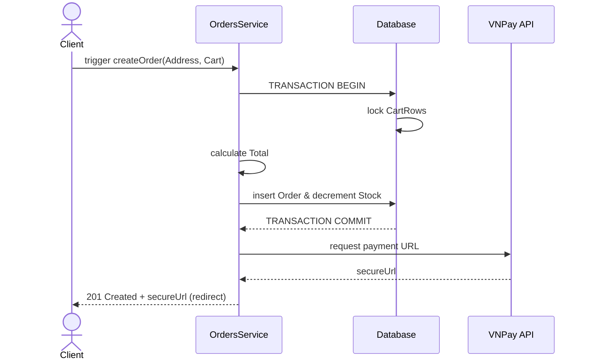
```mermaid
sequenceDiagram
    actor App as Client
    participant Svc as OrdersService
    participant DB as Database
    participant VNPay as VNPay API

    App->>Svc: trigger createOrder(Address, Cart)
    Svc->>DB: TRANSACTION BEGIN
    DB->>DB: lock CartRows
    Svc->>Svc: calculate Total
    Svc->>DB: insert Order & decrement Stock
    DB-->>Svc: TRANSACTION COMMIT
    
    Svc->>VNPay: request payment URL
    VNPay-->>Svc: secureUrl
    Svc-->>App: 201 Created + secureUrl (redirect)
```

---

## 3.6 Process Payment Webhook
Autonomous webhook processing VNPay payment confirmations.

### 3.6.1 Class Diagram
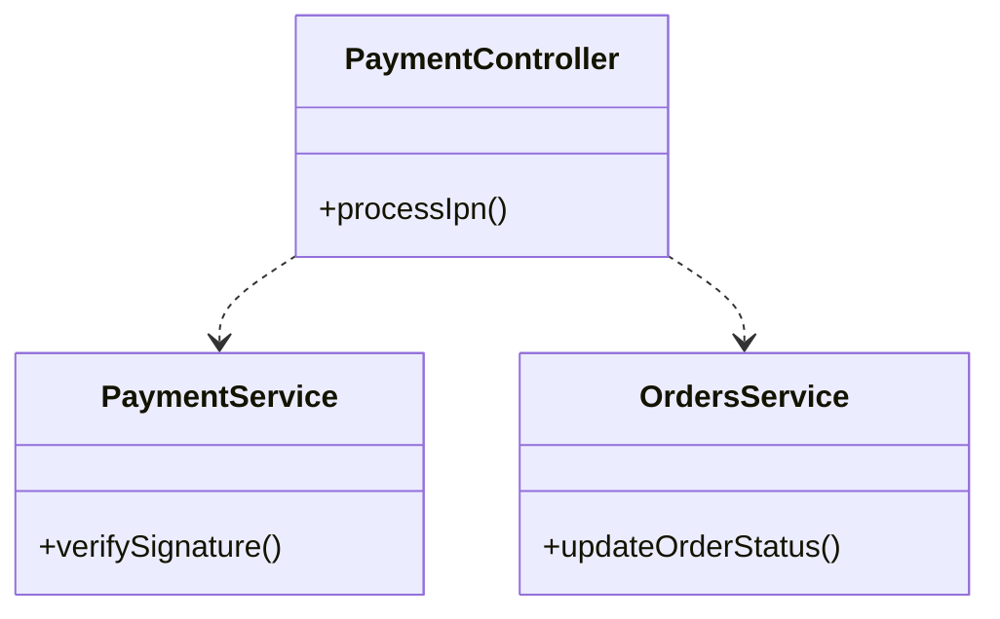
```mermaid
classDiagram
    class PaymentController {
        +processIpn()
    }
    class PaymentService {
        +verifySignature()
    }
    class OrdersService {
        +updateOrderStatus()
    }
    PaymentController ..> PaymentService
    PaymentController ..> OrdersService
```

### 3.6.2 Class Specifications
- **PaymentController:** Fully public IPN listener interface.
- **OrdersService:** Executes the DB mutations returning items bounds to an order.

### 3.6.3 Sequence Diagram
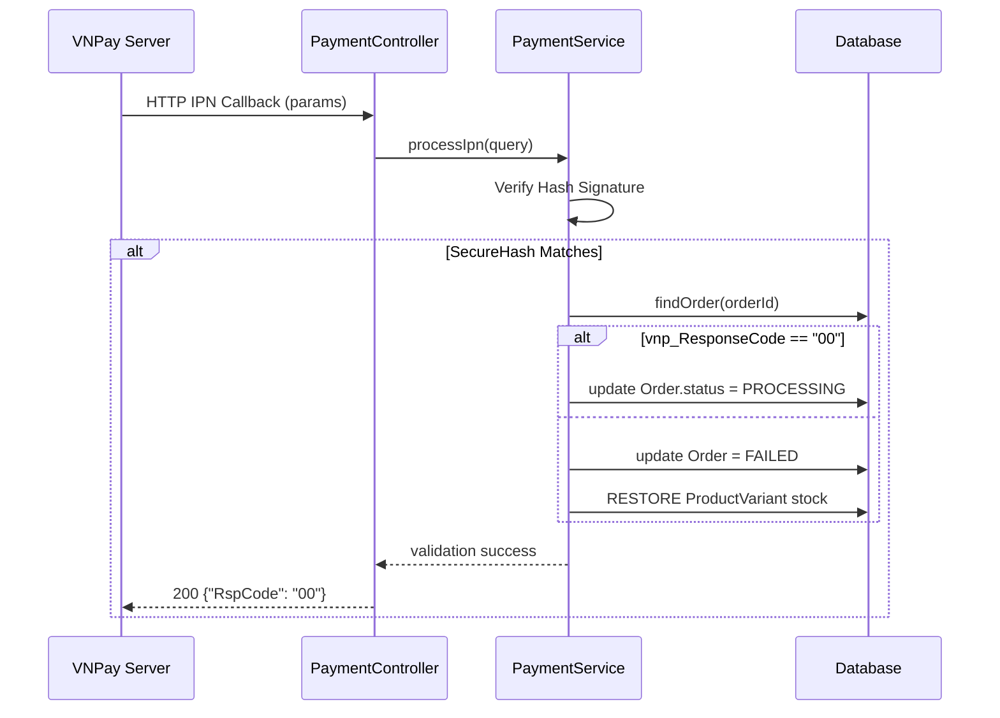
```mermaid
sequenceDiagram
    participant VNPay as VNPay Server
    participant Ctrl as PaymentController
    participant Svc as PaymentService
    participant DB as Database

    VNPay->>Ctrl: HTTP IPN Callback (params)
    Ctrl->>Svc: processIpn(query)
    Svc->>Svc: Verify Hash Signature
    alt SecureHash Matches
        Svc->>DB: findOrder(orderId)
        alt vnp_ResponseCode == "00"
            Svc->>DB: update Order.status = PROCESSING
        else
            Svc->>DB: update Order = FAILED
            Svc->>DB: RESTORE ProductVariant stock
        end
        Svc-->>Ctrl: validation success
        Ctrl-->>VNPay: 200 {"RspCode": "00"}
    end
```

---

## 3.7 Perform In-Store POS Sale
Staff sells items directly over the counter from local store stock.

### 3.7.1 Class Diagram
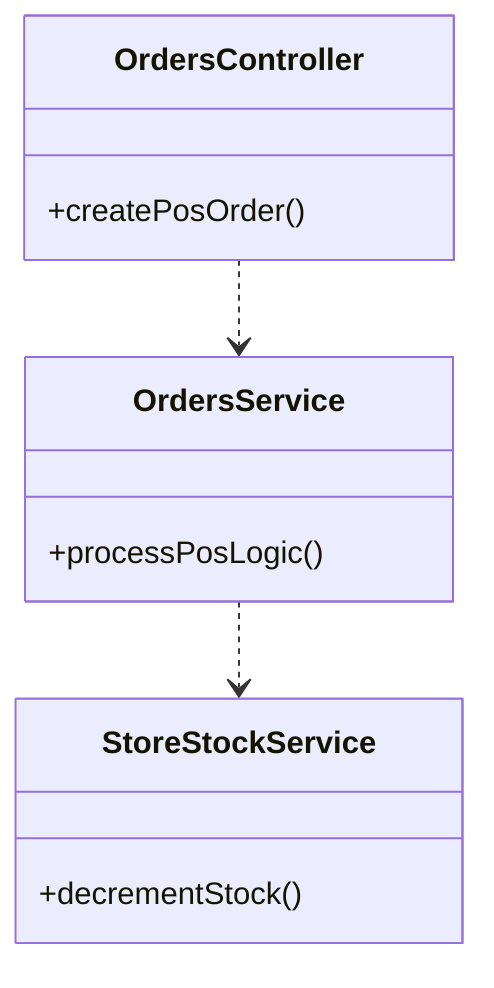
```mermaid
classDiagram
    class OrdersController {
        +createPosOrder()
    }
    class OrdersService {
        +processPosLogic()
    }
    class StoreStockService {
        +decrementStock()
    }
    OrdersController ..> OrdersService
    OrdersService ..> StoreStockService
```

### 3.7.2 Class Specifications
- **StoreStockService:** Checks and enforces quantities within bounded physical store.

### 3.7.3 Sequence Diagram
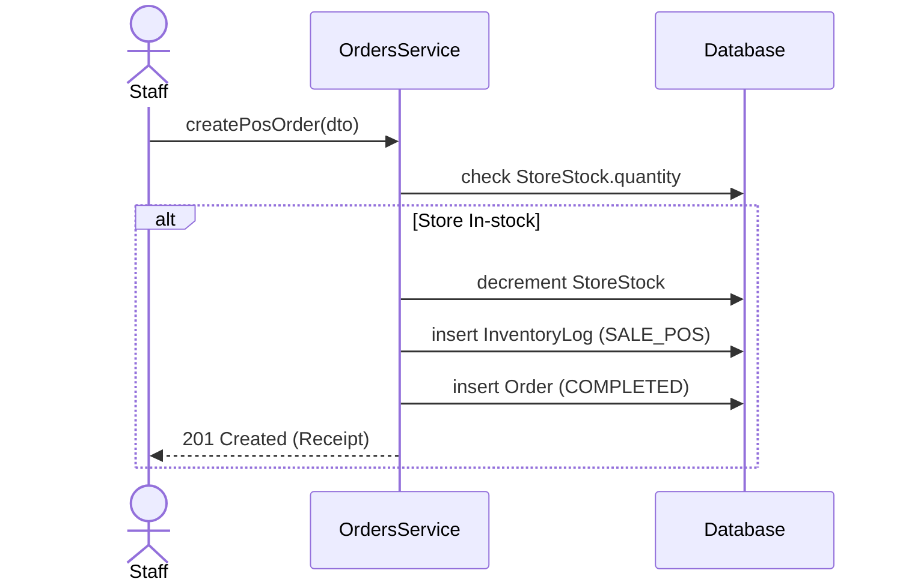
```mermaid
sequenceDiagram
    actor Staff
    participant Svc as OrdersService
    participant DB as Database

    Staff->>Svc: createPosOrder(dto)
    Svc->>DB: check StoreStock.quantity
    alt Store In-stock
        Svc->>DB: decrement StoreStock
        Svc->>DB: insert InventoryLog (SALE_POS)
        Svc->>DB: insert Order (COMPLETED)
        Svc-->>Staff: 201 Created (Receipt)
    end
```

---

## 3.8 Process Inventory Import Workflow
Multi-layered staff request matrix to safely import new physical units.

### 3.8.1 Class Diagram
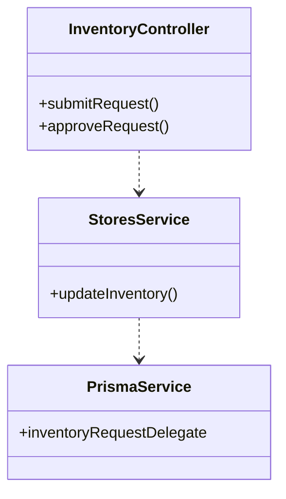
```mermaid
classDiagram
    class InventoryController {
        +submitRequest()
        +approveRequest()
    }
    class StoresService {
        +updateInventory()
    }
    class PrismaService {
        +inventoryRequestDelegate
    }
    InventoryController ..> StoresService
    StoresService ..> PrismaService
```

### 3.8.2 Class Specifications
- **InventoryController:** Segregates requests between creator roles and approver roles.

### 3.8.3 Sequence Diagram
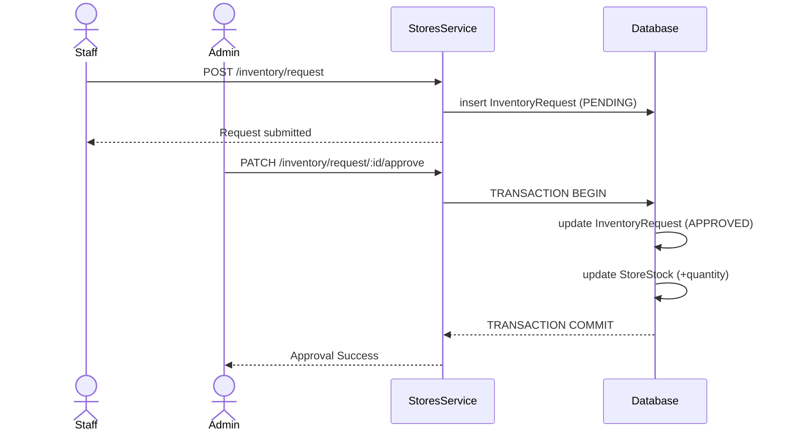
```mermaid
sequenceDiagram
    actor Staff
    actor Admin
    participant Svc as StoresService
    participant DB as Database

    Staff->>Svc: POST /inventory/request
    Svc->>DB: insert InventoryRequest (PENDING)
    Svc-->>Staff: Request submitted
    
    Admin->>Svc: PATCH /inventory/request/:id/approve
    Svc->>DB: TRANSACTION BEGIN
    DB->>DB: update InventoryRequest (APPROVED)
    DB->>DB: update StoreStock (+quantity)
    DB-->>Svc: TRANSACTION COMMIT
    Svc-->>Admin: Approval Success
```

---

## 3.9 Process Order Return & Refund
Handles reverse logistics when a customer disputes an item.

### 3.9.1 Class Diagram
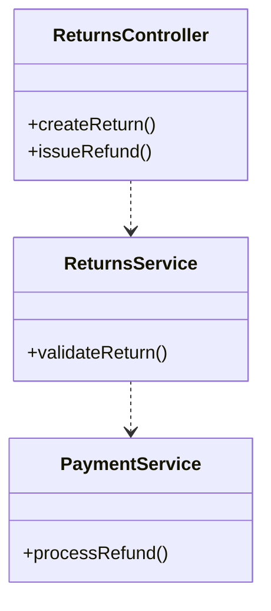
```mermaid
classDiagram
    class ReturnsController {
        +createReturn()
        +issueRefund()
    }
    class ReturnsService {
        +validateReturn()
    }
    class PaymentService {
        +processRefund()
    }
    ReturnsController ..> ReturnsService
    ReturnsService ..> PaymentService
```

### 3.9.2 Class Specifications
- **ReturnsService:** Enforces 7-day cutoff validations and initiates refund algorithms.

### 3.9.3 Sequence Diagram
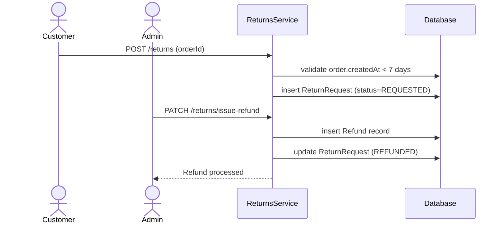
```mermaid
sequenceDiagram
    actor Customer
    actor Admin
    participant Svc as ReturnsService
    participant DB as Database

    Customer->>Svc: POST /returns (orderId)
    Svc->>DB: validate order.createdAt < 7 days
    Svc->>DB: insert ReturnRequest (status=REQUESTED)
    
    Admin->>Svc: PATCH /returns/issue-refund
    Svc->>DB: insert Refund record
    Svc->>DB: update ReturnRequest (REFUNDED)
    Svc-->>Admin: Refund processed
```

---

## 3.10 Admin Publish Product
Admin adds a new perfume catalog involving external image CDN uploads.

### 3.10.1 Class Diagram
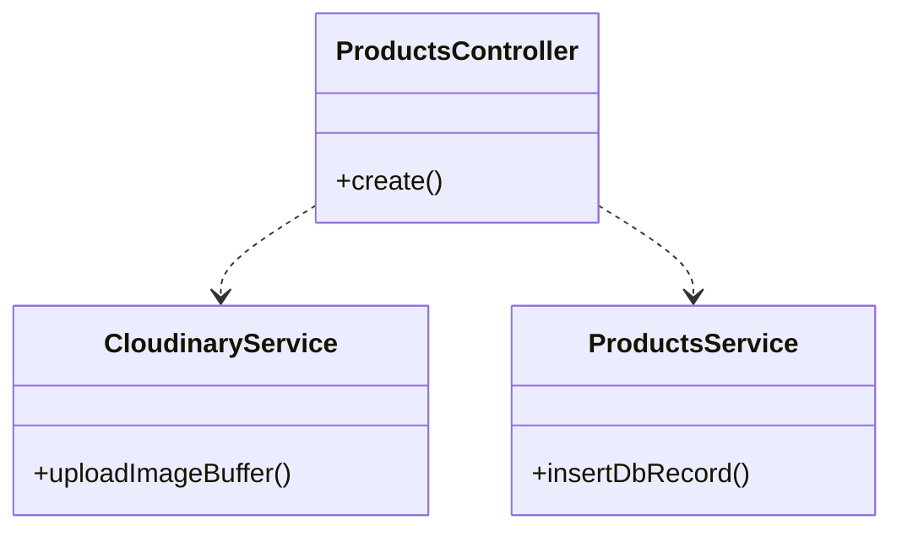
```mermaid
classDiagram
    class ProductsController {
        +create()
    }
    class ProductsService {
        +insertDbRecord()
    }
    class CloudinaryService {
        +uploadImageBuffer()
    }
    ProductsController ..> CloudinaryService
    ProductsController ..> ProductsService
```

### 3.10.2 Class Specifications
- **CloudinaryService:** Encapsulates the Cloudinary SDK streaming pipeline.

### 3.10.3 Sequence Diagram
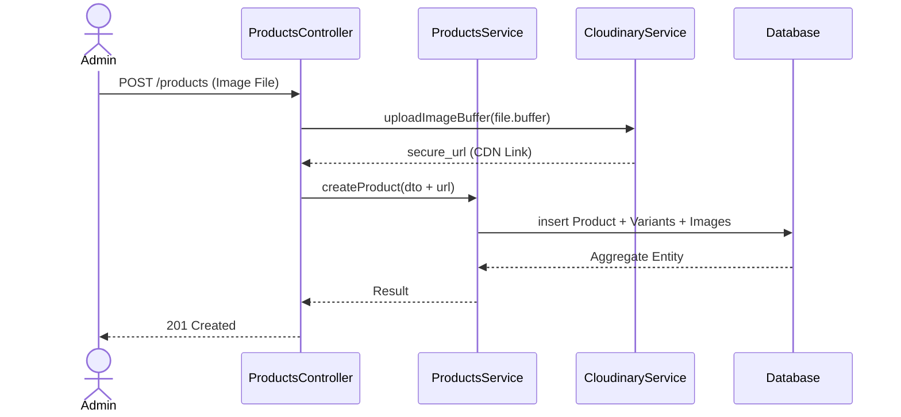
```mermaid
sequenceDiagram
    actor Admin
    participant Ctrl as ProductsController
    participant Svc as ProductsService
    participant Cloud as CloudinaryService
    participant DB as Database

    Admin->>Ctrl: POST /products (Image File)
    Ctrl->>Cloud: uploadImageBuffer(file.buffer)
    Cloud-->>Ctrl: secure_url (CDN Link)
    
    Ctrl->>Svc: createProduct(dto + url)
    Svc->>DB: insert Product + Variants + Images
    DB-->>Svc: Aggregate Entity
    Svc-->>Ctrl: Result
    Ctrl-->>Admin: 201 Created
```

---

## 3.11 Publish Product Review
Allows customers to ratify products post-delivery preventing spam manipulation.

### 3.11.1 Class Diagram
```mermaid
classDiagram
    class ReviewsController {
        +createReview()
    }
    class ReviewsService {
        +validateOrderOwnership()
    }
    class PrismaService {
        +reviewDelegate
    }
    ReviewsController ..> ReviewsService
    ReviewsService ..> PrismaService
```

### 3.11.2 Class Specifications
- **ReviewsService:** Confirms user definitively purchased the distinct `orderItemId` before permitting posting.

### 3.11.3 Sequence Diagram
```mermaid
sequenceDiagram
    actor Customer
    participant Svc as ReviewsService
    participant DB as Database

    Customer->>Svc: POST /reviews (orderItemId, rating)
    Svc->>DB: Verify OrderItem belongs to Customer
    Svc->>DB: Check if Review already exists
    alt Authorized & New
        Svc->>DB: Insert Review (isVerified=true)
        DB-->>Svc: success
        Svc-->>Customer: 201 Created
    end
```

---

## 3.12 Apply Promotion Code
Dynamic calculation of voucher deductibles integrated with loyalty points.

### 3.12.1 Class Diagram
```mermaid
classDiagram
    class PromotionsController {
        +applyPromo()
    }
    class PromotionsService {
        +calculateDiscount()
    }
    class CartService {
        +getCartTotal()
    }
    PromotionsController ..> PromotionsService
    PromotionsService ..> CartService
```

### 3.12.2 Class Specifications
- **PromotionsService:** Valuates the cart sum to determine percentage or global ceilings logic.

### 3.12.3 Sequence Diagram
```mermaid
sequenceDiagram
    actor Customer
    participant Svc as PromotionsService
    participant DB as Database

    Customer->>Svc: POST /cart/apply-promo (code)
    Svc->>DB: findUnique(code)
    Svc->>DB: get Cart Total
    Svc->>Svc: Validate minOrderAmount & Expiration
    alt Valid
        Svc->>DB: create AppliedPromotion
        Svc-->>Customer: 200 OK (New Discounted Total)
    else Invalid
        Svc-->>Customer: 400 Error (Conditions not met)
    end
```

---

## 3.13 View Admin Dashboard Analytics
Admin retrieves summarized metrics mapping historical sales.

### 3.13.1 Class Diagram
```mermaid
classDiagram
    class AnalyticsController {
        +getRevenueStats()
    }
    class AnalyticsService {
        +aggregateSalesData()
    }
    class PrismaService {
        +orderDelegate
    }
    AnalyticsController ..> AnalyticsService
    AnalyticsService ..> PrismaService
```

### 3.13.2 Class Specifications
- **AnalyticsService:** Executes raw highly-optimized PostgreSQL queries to compile time-series charts.

### 3.13.3 Sequence Diagram
```mermaid
sequenceDiagram
    actor Admin
    participant Ctrl as AnalyticsController
    participant Svc as AnalyticsService
    participant DB as Database

    Admin->>Ctrl: GET /dashboard/revenue?period=monthly
    Ctrl->>Svc: getRevenueStats(period)
    Svc->>DB: GROUP BY DATE(createdAt), SUM(finalAmount)
    DB-->>Svc: raw time-series metrics
    Svc-->>Ctrl: formatted Chart JSON
    Ctrl-->>Admin: 200 OK
```

---

## 3.14 Take AI Scent Quiz
Guides the user through an interactive workflow to formulate their Scent Profile.

### 3.14.1 Class Diagram
```mermaid
classDiagram
    class QuizController {
        +submitQuizOptions()
    }
    class QuizService {
        +parseQuizResults()
    }
    class PrismaService {
        +quizResultDelegate
        +userPreferenceDelegate
    }
    QuizController ..> QuizService
    QuizService ..> PrismaService
```

### 3.14.2 Class Specifications
- **QuizService:** Transcribes multiple-choice UI options into hard ScentNote / Family DB preferences used universally by AI.

### 3.14.3 Sequence Diagram
```mermaid
sequenceDiagram
    actor Customer
    participant Ctrl as QuizController
    participant Svc as QuizService
    participant DB as Database

    Customer->>Ctrl: POST /quiz/submit (answers)
    Ctrl->>Svc: processQuizAnswers(userId, dto)
    Svc->>DB: Create QuizResult Log
    Svc->>Svc: Map Answers to ScentFamilies
    Svc->>DB: Upsert UserScentPreference
    DB-->>Svc: User Profile updated
    Svc-->>Ctrl: mapped Profile + Recommendations
    Ctrl-->>Customer: 201 Created
```

---

## 3.15 Request & Reset Password
Secure workflow integrating standard SMTP Mail services to recover lost credentials.

### 3.15.1 Class Diagram
```mermaid
classDiagram
    class AuthController {
        +forgotPassword()
        +resetPassword()
    }
    class AuthService {
        +generateResetToken()
        +updatePassword()
    }
    class MailService {
        +sendResetEmail()
    }
    AuthController ..> AuthService
    AuthService ..> MailService
```

### 3.15.2 Class Specifications
- **AuthService:** Produces cryptographic short-lived tokens. 
- **MailService:** Dispatches SMTP packets to user's registered Email inbox.

### 3.15.3 Sequence Diagram
```mermaid
sequenceDiagram
    actor Customer
    participant Svc as AuthService
    participant Mail as MailService
    participant DB as Database

    %% Forgot Flow
    Customer->>Svc: POST /auth/forgot-password (email)
    Svc->>DB: findUserByEmail()
    Svc->>Svc: generate Cryptographic Token
    Svc->>DB: update User (resetToken, expireTime)
    Svc->>Mail: sendResetEmail(email, TokenLink)
    Mail-->>Customer: Email Delivered
    
    %% Reset Flow
    Customer->>Svc: POST /auth/reset-password (Token, newPassword)
    Svc->>DB: findUserByToken()
    Svc->>Svc: Require Token is Valid && !Expired
    Svc->>Svc: bcrypt.hashSync(newPassword)
    Svc->>DB: update User (clear Token, update Hash)
    Svc-->>Customer: 200 OK (Password Reset Success)
```

---

## 3.16 Manage Shipping Addresses
Customer workflow parsing GHN (Giao Hàng Nhanh) geographic mappings internally.

### 3.16.1 Class Diagram
```mermaid
classDiagram
    class AddressesController {
        +addAddress()
    }
    class AddressesService {
        +syncGhnGeodata()
    }
    class GhnApiService {
        +fetchProvinces()
    }
    AddressesController ..> AddressesService
    AddressesService ..> GhnApiService
```

### 3.16.2 Class Specifications
- **AddressesService:** Ensures address strings align perfectly with GHN's strict Int ID requirements for shipping cost calculation.

### 3.16.3 Sequence Diagram
```mermaid
sequenceDiagram
    actor Customer
    participant Ctrl as AddressesController
    participant Svc as AddressesService
    participant Ghn as GhnApiService
    participant DB as Database

    Customer->>Ctrl: POST /addresses (ProvinceID, Text)
    Ctrl->>Svc: addAddress(userId, dto)
    Svc->>Ghn: GET /master-data/district
    Ghn-->>Svc: District Validation Details
    Svc->>DB: Insert UserAddress
    alt isDefault == true
        Svc->>DB: update other addresses (isDefault=false)
    end
    DB-->>Svc: Persisted
    Svc-->>Ctrl: Address Record
    Ctrl-->>Customer: 201 Created
```

---

## 3.17 Publish Journal & Blog Entries
Content management operations for Admin editorial capabilities natively in the system.

### 3.17.1 Class Diagram
```mermaid
classDiagram
    class JournalsController {
        +createArticle()
    }
    class JournalsService {
        +mapProductLinks()
    }
    class PrismaService {
        +journalDelegate
    }
    JournalsController ..> JournalsService
    JournalsService ..> PrismaService
```

### 3.17.2 Class Specifications
- **JournalsService:** Manages hierarchical structures of an Article (Header) mapped to various distinct content Blocks (Sections).

### 3.17.3 Sequence Diagram
```mermaid
sequenceDiagram
    actor Admin
    participant Svc as JournalsService
    participant DB as Database

    Admin->>Svc: POST /journals (Article Data + Sections[])
    Svc->>DB: TRANSACTION BEGIN
    Svc->>DB: insert Journal (Title, HeaderImage)
    loop for each Section
        Svc->>DB: insert JournalSection (Content, Optional productId)
    end
    DB-->>Svc: TRANSACTION COMMIT
    Svc-->>Admin: 201 Created
```
