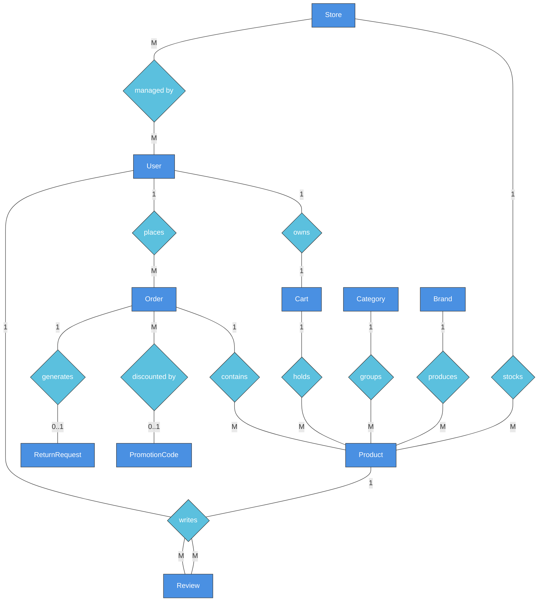

### 3.1.5 Entity Relationship Diagram

[This section provides the conceptual semantic entity-relationship mapping mimicking the standard Chen ERD notation (Entities as Rectangles, Relationships as Diamonds) mapped to the core schemas of Perfume-Sales, alongside their entity definitions.]

#### Entities Description

| # | Entity | Description |
| :--- | :--- | :--- |
| 1 | **User** | The core actor of the system encompassing all roles (Customer, Staff, Admin). Stores identity, loyalty points, and references to their physical address books. |
| 2 | **Order** | The immutable transaction ledger representing a complete Checkout (either Online via gateway or In-store POS), locked prices, and shipping logistics. |
| 3 | **Product** | The central catalog entity representing a unique perfume, holding attributes like fragrance notes, longevity, and mapping to distinct physical variant sizes. |
| 4 | **Cart** | The volatile, temporary basket assigned 1-to-1 to a shopping Customer to hold anticipated items before finalizing the checkout process. |
| 5 | **Store** | Geographical boutique point-of-sale locations where physical Inventory (stock) is localized and managed individually by assigned Staff. |
| 6 | **Category** | High-level taxonomies categorizing products into application sets (e.g., EDP, EDT, Parfum). |
| 7 | **Brand** | The manufacturer organizations producing the perfumes (e.g., Chanel, Dior, Zara). |
| 8 | **Review** | User-generated feedback (1-5 Star Ratings and textual insights) logically tied to authorized purchased Products to prevent falsification. |
| 9 | **ReturnRequest** | Reverse-logistics entity generated post-delivery when a Customer claims damages or requests refunds, requiring Admin workflow approval. |
| 10 | **PromotionCode** | Marketing mechanism providing financial discounts mapping percentage or fixed-amount deductibles enforced with usage bounds. |

*(Note: While the physical database contains 50 granular tables to handle conjunctions like `CartItem` or `OrderHistory`, this Diagram isolates the major Conceptual Entities mapping the raw business interactions logic of the Perfume-Sales platform).*
