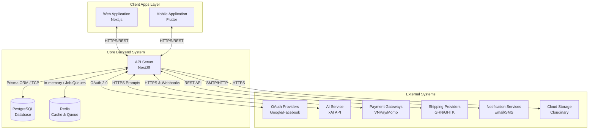
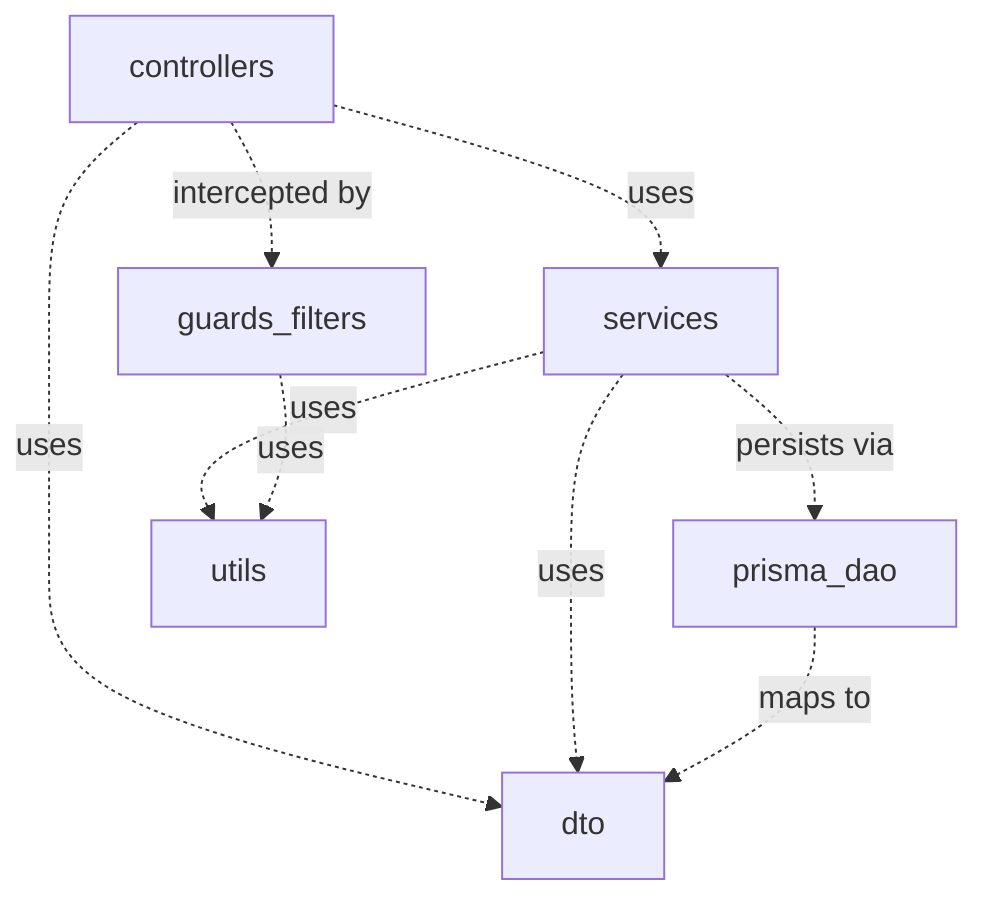

# 1. System Design

## 1.1 System Architecture

This section visualizes the high-level architecture of the PerfumeGPT system, including the internal sub-systems, external integration services, and the data flow between them.

### Components Description

#### Internal Sub-systems
*   **Web Application (Next.js):** The frontend application serving Customers (Shopping, AI chat), Staff (POS system), and Admin (Dashboard, Management). Built with Next.js for SEO and Server-Side Rendering (SSR).
*   **Mobile Application (Flutter):** The native mobile application providing a mobile-friendly shopping experience, AI consultation, barcode scanning, and order tracking for both customers and staff.
*   **API Server (NestJS):** The core business backend containing the RESTful API endpoints, application logic, authorization rules, and integrations with all third parties.
*   **PostgreSQL Database:** The persistent relational database managed via Prisma ORM. Stores structured data including user profiles, products, orders, scent attributes, and reviews.
*   **Redis Cache & Queue:** Manages token caching, rapid session lookups, AI rate-limiting, and background queue processing (like async emails or shipment syncs).

#### External Systems
*   **OAuth Providers (Google/Facebook):** External IDPs (Identity Providers) authenticating users quickly via social login.
*   **AI Service (xAI API):** External LLM processing natural language prompts from users to suggest personalized perfume recommendations.
*   **Payment Gateways (VNPay/Momo):** Services that handle and process digital payment transactions, returning automated webhooks to the API on success.
*   **Shipping Providers (GHN/GHTK):** Logistics platforms providing APIs to calculate real-time shipping fees and synchronize delivery statuses.
*   **Notification Services:** External SMS and email SMTP providers (e.g., SendGrid, Twilio) that dispatch order receipts and OTPs.
*   **Cloudinary (CDN):** External media server processing and hosting high-quality perfume images and promotional banners.

---

## 1.2 Package Diagram

This section dissects the internal package components of the main **API Server (NestJS)** sub-system, demonstrating how cross-cutting modules interact to process a single request, modeled via MVC-like dependencies.

### Package Descriptions

| No | Package | Description |
| :--- | :--- | :--- |
| **01** | `controllers` | The Presentation layer of the API. Captures incoming HTTP requests, extracts parameters, and delegates the core processing to the respective `services`. It maps responses back to the client. |
| **02** | `services` | Holds the core Business Logic. Computes prices, applies discount rules, orchestrates external AI and Payment API calls, and dictates data manipulation workflows. |
| **03** | `dto` | Data Transfer Objects (similar to `bean` or `models`). Contains classes defining the shape of the data and validation decorators to ensure data integrity entering and leaving the system. |
| **04** | `prisma_dao` | The Data Access Object layer managed by Prisma ORM. Responsible for executing pure database queries (SELECT, INSERT, UPDATE, DELETE) against the PostgreSQL instance. |
| **05** | `guards_filters` | Cross-cutting middleware components. `guards` handle Authentication and Role-based Authorization (e.g., JwtAuthGuard). `filters` catch system exceptions and format error responses to the client. |
| **06** | `utils` | Shared utility classes and helper functions utilized globally across the application, such as password hashing, string manipulation, date formatting, and constant definitions. |
